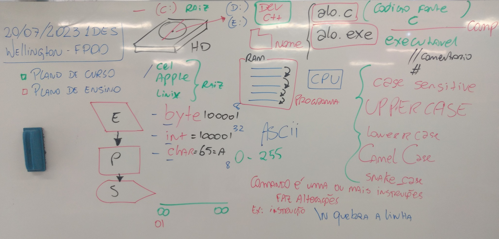

# Aula01 - FPOO
## Fundamentos de Programação Orientada a Objeto
- Alô mundo em C (alo.c)
```c
#include <stdio.h>
int main(){
	printf("Alô mundo");
	return 0;
}

```
- Alô mundo em Python (alo.py)
```python
print("Alô mundo");

```


### Links
- Download DEV C++
    - https://sourceforge.net/projects/orwelldevcpp/
- Hello World Como Você Nunca Viu! | Entendendo C (Vídeo do Akita)
    - https://www.youtube.com/watch?v=Gp2m8ZuXoPg
- Ferramenta para desenhar fluxogramas
    - http://draw.io

### Conhecimentos
- Linguagem de programação
    - 1.1. Princípios
    - 1.2. Caraterísticas
    - 1.3. Tipos
        - 1.3.1. Compilada

#### 1.1. Princípios e 1.2. Caraterísticas
Linguagem humana de alto médio a alto nível (C, C++, C#, Java, Python ...)
Todas servem para criar aplicativos e sistemas, porém cada uma atende melhor a um determinado propósito ou stack:
- Desktop
- Web Front End
- Web Back End
- Mobile
- Iot
- AI
- Comercial
- Científica
- Games
#### 1.3. Tipos
- 1.3.1. Compilada (O código fonte se transforma em linguagem de máquina e é exclusiva do sistema operacional onde foi compilada)
- Um programa compilado normalmente é:
    - mais rápido, pois possui parte do SO anexo.
    - é adequado a um tipo de hardware.
    - Exclusivo do sistema operacional onde foi compilado
    - Ex: C, C#
- 1.3.2. Interpretada (O código fonte é executado diretamente por um servidor de aplicação ou o próprio navegador)
    - Não tão rápida como a compilada, pois é decodificada em tempo real
    - Necessita de menos recursos do Sistema Operacional ou nenhum
    - Ex: HTML, CSS, JavaScript
- Hibrida ou VM (Geralmente utiliza recursos do sistema operacional ou máquinas virtuais)
    - Semi compilada
    - Necessita de uma máquina virtual
    - Ex: Java