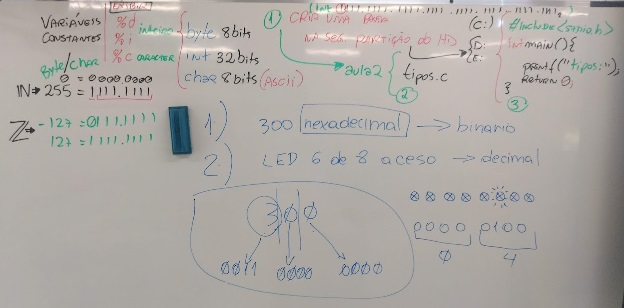

# Aula02 - Tipos de variáveis e constantes


- Exemplos de manipulação de variáveis:
- tipos1.c
```c
#include <stdio.h>
int main(){
	int x; //Declarando vari�vel
	x = 127; //Atribuindo valor
	printf("Variavel x = %d",x);
	return 0;
}

```
- tipos2.c
```c
#include <stdio.h>
int main(){
	int x; //Declarando vari�vel
	x = 'A'; //Atribuindo valor
	printf("Variavel x = %c",x);
	return 0;
}

```
- tipos3.c
```c
#include <stdio.h>
int main(){
	int x = -2147483647; //Declarar e atribuir
	printf("Variavel x = %i",x);
	return 0;
}

```
- tipos4.c
```c
#include <stdio.h>
int main(){
	char x = 'A'; //Declarar e atribuir
	char y = -127;
	printf("Variavel x = %i \n",x);
	printf("Variavel x = %c \n",x);
	printf("Variavel y = %i \n",y);
	printf("Variavel y = %c \n",y);
	return 0;
}

```

## Desafios

- 1. Faça um programa em C com duas variáveis atribuídas com valores inteiros quaisquer, **some** as variáveis e armazene o valor em uma terceira variável. Exiba na tela o resultado. (Nome do arquivo ex1.c)

- solução 1:
```c
#include <stdio.h>
int main(){
	int x = 10;
	int y = 5;
	int z = x + y;
	printf("X = %d \n",x);
	printf("Y = %d \n",y);
	printf("X + Y = %d",z);
	return 0;
}
```
- Solução 2: Exemplo de processamento na saída
```c
#include <stdio.h>
int main(){
	int x = 10;
	int y = 5;
	printf("X = %d \n",x);
	printf("Y = %d \n",y);
	printf("X + Y = %d",x + y);
	return 0;
}
```
- Solução 3: Exemplo de várias saídas na mesma linha
```c
#include <stdio.h>
int main(){
	int x = 10;
	int y = 5;
	int z = x + y;
	printf("x = %d \ny = %d \nx + y = %d", x, y, z);
	return 0;
}
```