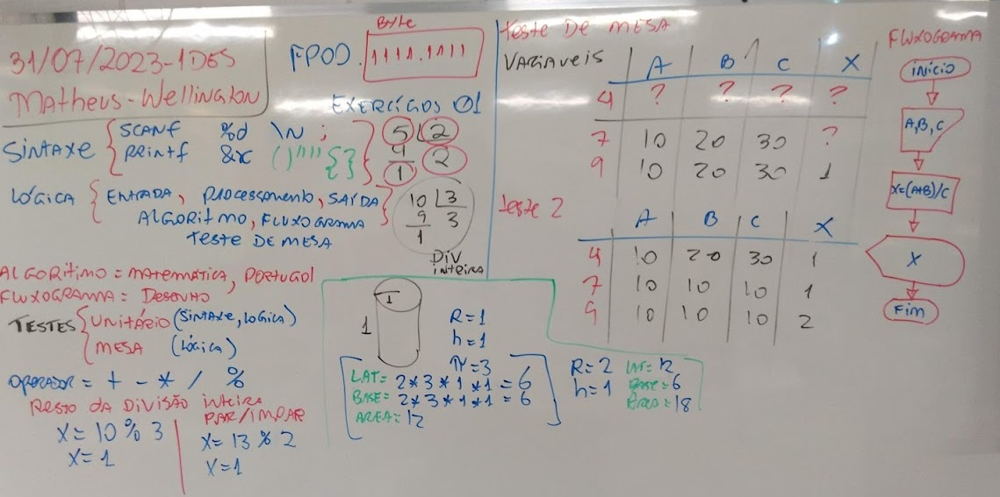

# Aula03 - Correção de exercícios
## Operadores aritméticos

## Conhecimentos
- 1. Linguagem de programação
- 1.1. Princípios
- 1.2. Caraterísticas
- 1.3. Tipos
- 1.3.1. Compilada
- 1.3.2. Interpretada
 

## Correção de dois exercícios da lista da aula02