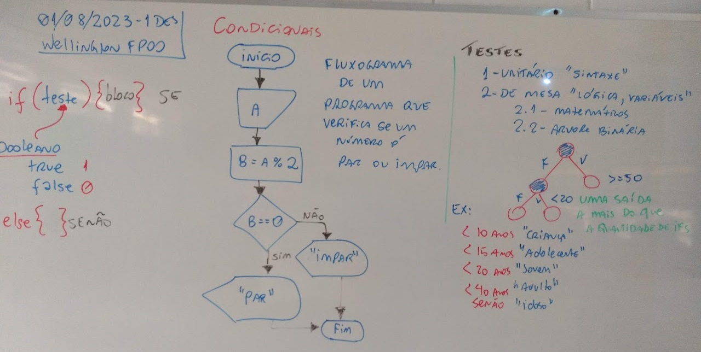
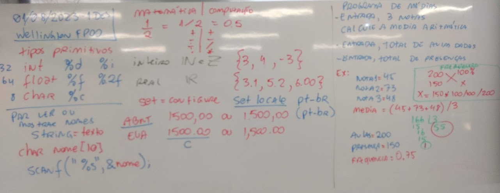
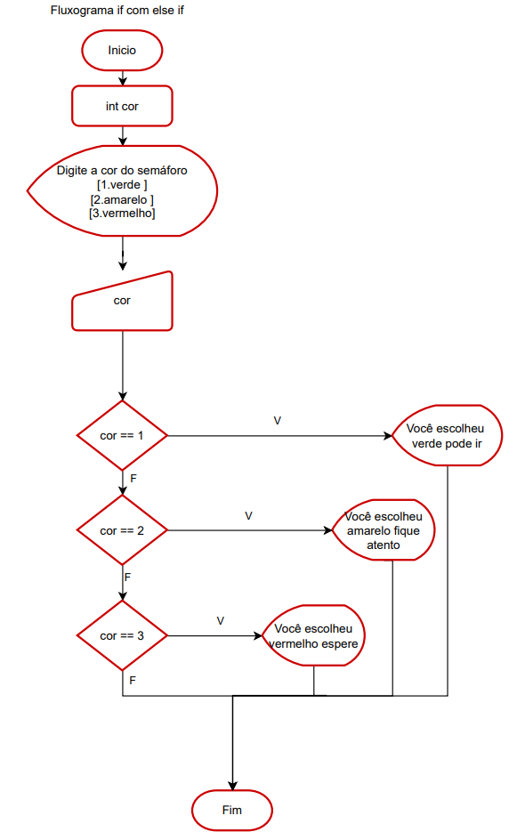

# Aula04
## Condicionais (if) ou (se)
    - if(teste lógico){verdadeiro}
    - if(teste lógico){verdadeiro} else {falso}
    - if(teste lógico){verdadeiro} else if(teste lógico) {verdadeiro} else {falso}
    - else = senão

- 
- 

## Árvore binária


# Teste lógico
- (==) igual
- (!=) diferente
- (>) maior
- (<) menor
- (>=) maior ou igual
- (<=) menor ou igual

- && => AND => E
- || => OR => OU
- ! => NOT => NÃO

# Tabela verdade
<table border="0">
	<tr>
		<td>
			<table border="1">
				<tr><td colspan="3">AND</td></tr>
				<tr><td>V</td><td>V</td><td>V</td></tr>
				<tr><td>V</td><td>F</td><td>F</td></tr>
				<tr><td>F</td><td>V</td><td>F</td></tr>
				<tr><td>F</td><td>F</td><td>F</td></tr>
			</table>
		</td>
		<td>
			<table border="1">
				<tr><td colspan="3">OR</td></tr>
				<tr><td>V</td><td>V</td><td>V</td></tr>
				<tr><td>V</td><td>F</td><td>V</td></tr>
				<tr><td>F</td><td>V</td><td>V</td></tr>
				<tr><td>F</td><td>F</td><td>F</td></tr>
			</table>
		</td>
		<td>
			<table border="1">
				<tr><td colspan="2">NOT</td></tr>
				<tr><td>V</td><td>F</td></tr>
				<tr><td>F</td><td>V</td></tr>
			</table>
		</td>
	</tr>
</table>

# Exemplos
- exp1.c
```c
#include <stdio.h>
int main(){
	if(1) printf("Verdadeiro\n");
	if(0) printf("Falso");
	return 0;
}
```
- Caso queiramos utilizar as palavras reservadas **true** ou **false** ou variáveis do tipo **bool** precisamos da biblioteca <stdbool.h>
```c
#include <stdio.h>
#include <stdbool.h>
int main(){
	if(true) printf("Verdadeiro\n");
	if(false) printf("Falso");
	return 0;
}
```
- Os dois exemplos acima mostram **"Verdadeiro"**
- exp2.c
```c
#include <stdio.h>
/*Programa que lê um número "a" e informa se é par ou impar*/
int main(){
	//Declaração de variáveis
	int a, b;
	//Etrada de dados
	printf("Digite um número inteiro:");
	scanf("%d", &a);
	//Processamento (resto da divisão inteira)
	b = a % 2;
	//Saída com condicional SE o resto for 1 é impar, senão é par
	if(b) printf("Impar");
	else printf("Par");
	//Fim
	return 0;
}
```
- exp3.c
```c
#include <stdio.h>
/*Programa que avalia médias de 0 a 100 (Aprovado se maior ou igual a 50)*/
int main(){
	//Declaração de variáveis
	int media;
	//Etrada de dados
	printf("Digite a média final do aluno de 0 a 100:");
	scanf("%d", &media);
	//Processamento e saída com condicional
	if(media >= 50)
		printf("Aprovado");
	else
		printf("Reprovado");
	//Fim
	return 0;
}
```
-exp4.c
```c
#include <stdio.h>
/*Programa que avalia médias com três critérios
"Aprovado" >= 50
"Reprovado" < 20
"Recuperação" entre 20 e 49
*/
int main(){
	//Declaração de variáveis
	int media;
	//Etrada de dados
	printf("Digite a média final do aluno de 0 a 100:");
	scanf("%d", &media);
	//Processamento e saída com condicional
	if(media >= 50)
		printf("Aprovado");
	else{
		if(media < 20)
			printf("Reprovado");
		else
			printf("Recuperação");
	}
		
	//Fim
	return 0;
}
```
```c
#include <stdio.h>
/*Programa que avalia médias com três critérios
"Aprovado" >= 50
"Reprovado" < 20
"Recuperação" entre 20 e 49
Utilizando o esle if
*/
int main(){
	//Declaração de variáveis
	int media;
	//Etrada de dados
	printf("Digite a média final do aluno de 0 a 100:");
	scanf("%d", &media);
	//Processamento e saída com condicional
	if(media >= 50)
		printf("Aprovado");
	else if(media < 20)
		printf("Reprovado");
	else
		printf("Recuperação");	
	//Fim
	return 0;
}
```
exp5.c
```c

#include <stdio.h>
/*Programa que avalia médias com critérios
"Aprovado" >= 50 E Frequência >= 75 %
total de presenças
*/
int main(){
	//Declaração de variáveis
	int nota1, nota2, nota3, media;
	float aulas, presencas, frequencia;
	//Entradas
	printf("Digite as três notas separadas por espaços: ");
	scanf("%d %d %d", &nota1, &nota2, &nota3);
	printf("Digite o total de aulas dadas: ");
	scanf("%d",&aulas);
	printf("Digite o total de precenças: ");
	scanf("%d",&presencas);
	
	//Processamento
	media = (nota1 + nota2 + nota3) / 3;
	frequencia = presencas / aulas;
	
	//Saídas parciais
	printf("Média = %d\n", media);
	printf("Frequência = %.2f\t ou %.0f%%\n", frequencia, frequencia * 100);

	//Processamento e saída com condicional
	if(media >= 50 && frequencia >= 0.75)
		printf("Aprovado");
	else
		printf("Reprovado");
	//Fim
	return 0;
}
```
## Atividades práticas
- Desenvolva os programas a seguir conforme os **Fluxogramas**
- 1 
- 2 
- 3 

## Atividades EAD - Lista02
- 1 Desenvolva um programa que leia o preço de um produto e se o preço for maior do que 1000 reais aplique um desconto de 8%. Mostre o preço final.
- 2 Desenvolva um programa que leia o salário de um funcionário e o número de filhos. Se o salário for menor do que 2000 o funcionário receberá um salário família equivalente a 45 reais por filho. Apresente o salário final. 
- 3 Desenvolva um programa que calcule desconto de INSS de um funcionário, se o salário for menor ou igual a do que R$ 1212,00 reais será de 7,5%, se estiver entre R$ 1212,01 e 2427,35 será de 9%, se estiver entre R$ 2427,36 e R$ 3641,03 o desconto é 12%, se estiver entre R$ 3641,04 a R$ 7087,22 será de 14% e se for maior do que 7087,22 o teto que é o máximo cobrado 14% de 7087,22. Mostre o desconto e o valor do salário final.
- 4 Desenvolva um programa que leia os valores de três lados de um triângulo (a, b e c) e se os três lados forem diferentes escreva ESCALENO se os três lados forem iguais EQUILÁTERO e se apenas dois lados forem iguais ISÓSCELES. 
- 5 Desenvolva um programa que leia o nome e o preço de uma mercadoria. Se o preço for menor do que 1000 terá um aumento de 5% no preço da mercadoria, senão o aumento será de 7%. Mostrar o nome da mercadoria e o seu novo preço. 
- 6 Desenvolva um programa que leia 6 números inteiros e exiba na tela ao final, o maior número que foi digitado pelo usuáriou. 
- 7 Escreva um programa que leia 5 números inteiros em qualquer ordem e exiba na tela ao final, os cinco números em ordem crescente. 
- 8 Escreva um programa que leia dois números inteiros e determine qual é o maior e o menor.
- 9 Desenvolva um algortimo que faço o cálculo do reajuste salarial do funcionário, baseado nos seguintes parâmetros: 15% de aumento : 1.500,00 <= salario Atual < 1.750,00 12% de aumento : 1.750,00 <= salario Atual < 2.000,00 9% de aumento : 2.000,00 <= salario Atual < 3.000,00 6% de aumento : salario Atual >= 3.000,00
- 10 Crie um programa que calcule a média de 3 notas do aluno e informe sua situação: (nota maior ou igual a 6 : aprovado), (nota inferior a 6 e maior ou igual a 4 : recuperação), (nota menor que 4 : reprovado). 
- 11 Uma loja está fazendo uma promoção e precisa de ajuda no momento da venda, para liberar os descontos. Baseado na peça, calcule o desconto e exiba o valor final da venda. (camisa - 20% de desconto, bermuda - 10% de desconto, calça - 15% de desconto). 
