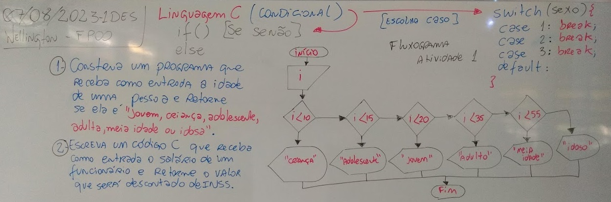

# Aula05 - Exempos Condicionais
## Linguagem C

## Exemplos
- exp1.c
```c
#include <stdio.h>
int main(){
	int i;
	printf("Informe sua idade: ");
	scanf("%d",&i);
	if(i<10) printf("Criança");
	else if(i<15) printf("Adolescente");
	else if(i<20) printf("Jovem");
	else if(i<35) printf("Adulto");
	else if(i<55) printf("Meia idade");
	else printf("Idoso");
	return 0;
}
```
- "Descontraindo, sabemos que as fases da vida passam diferente para homens e mulheres, segundo a teoria da relatividade moral de Alberto Ainstem."
- Desta forma faça com que o programa pergunte se o usuário é homem ou mulher e classifique de forma diferente
- exp2.c
```c
#include <stdio.h>
int main(){
	int i, sexo;
	printf("Informe sua idade: ");
	scanf("%d",&i);
	printf("Informe como você de identifica 1.mulher, 2.homem:");
	scanf("%d",&sexo);
	if(sexo == 1){
		if(i<10) printf("Criança");
		else if(i<15) printf("Adolescente");
		else if(i<20) printf("Jovem");
		else if(i<35) printf("Adulto");
		else if(i<55) printf("Meia idade");
		else printf("Idoso");
	} else {
		if(i<20) printf("Criança");
		else if(i<35) printf("Adolescente");
		else if(i<40) printf("Jovem");
		else if(i<50) printf("Adulto");
		else if(i<55) printf("Meia idade");
		else printf("Idoso");
	}
	return 0;
}
```