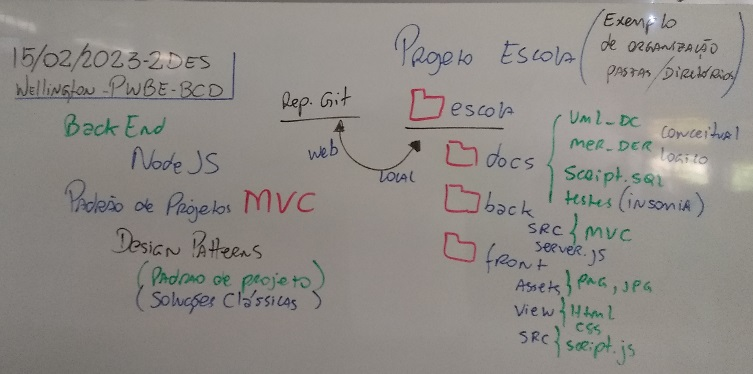

# 2. Padrão de desenvolvimento MVC
- 2.1. Definição
- 2.2. Aplicabilidade
- 2.3. Design patterns
# Primeiros Patterns
- GOF (Gangue dos 4)
	- Criação
	- Estrutura
	- Comportamento
# Continuação projeto Escola (Exemplo)
- 
- 
- Criando Script de criação e população do banco de dados com dados de teste