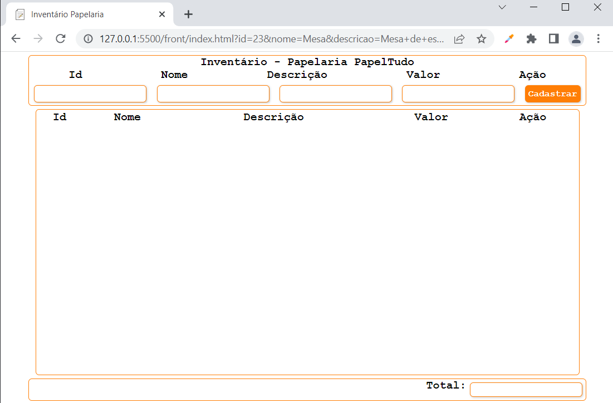
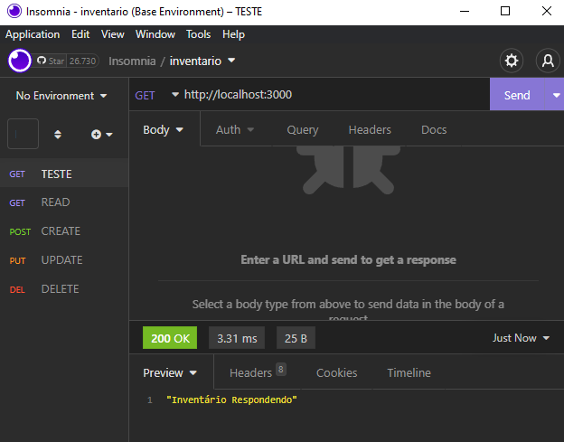
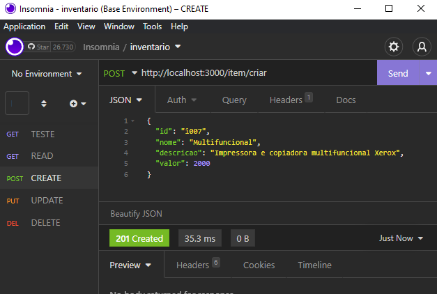
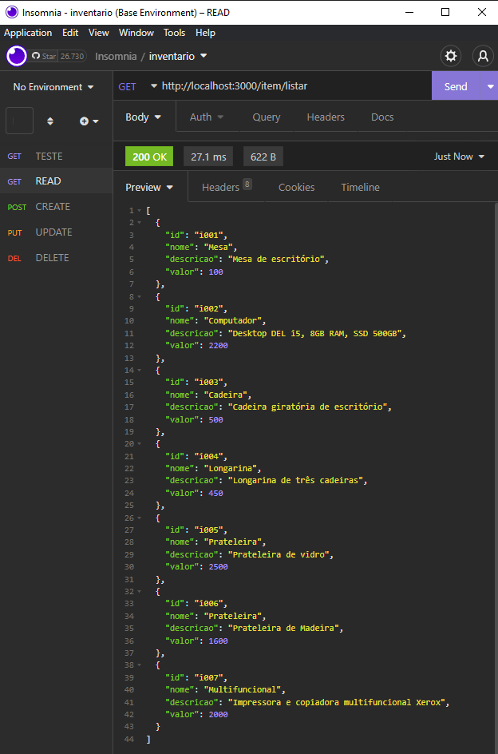
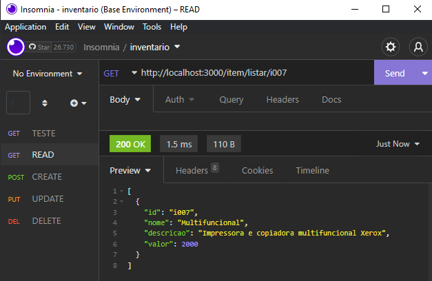
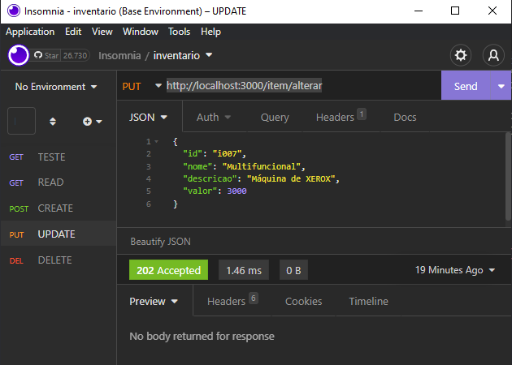
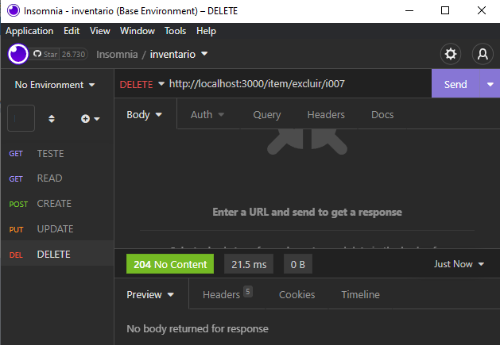
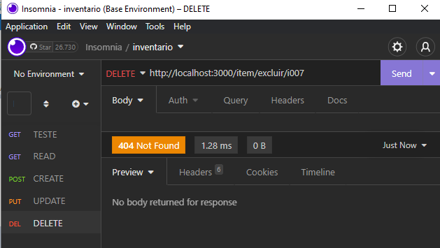

# Conhecimentos
* 2.3. Design patterns
* 3. Frameworks
* 3.1. Definição
* 3.2. Modelos e tipos
* 3.3. Instalação e configuração
* 3.4. Criação de projetos utilizando framework
* 4. Persistência de dados
* 4.1. Conexão com base de dados
* 4.2. CRUD

# CRUD com apenas uma tabela (Continuação)
- Ainda com o mesmo front da aula anterior


- Mesmo banco de dados

# Alterar o BackEnd (NodeJS) Acrescentando a Classe Model
## E alterando os arquivos conforme a seguir
- src/models/item.js
```javascript
class Item {

    constructor(i) {
        this.id = i.id
        this.nome = i.nome
        this.descricao = i.descricao
        this.valor = i.valor
    }

    create() {
        return `INSERT INTO item VALUE('${this.id}','${this.nome}','${this.descricao}',${this.valor})`
    }

    read() {
        if (this.id == undefined)
            return `SELECT * FROM item`
        else
            return `SELECT * FROM item WHERE id = '${this.id}'`
    }

    update() {
        return `UPDATE item SET nome = '${this.nome}', descricao = '${this.descricao}', valor = ${this.valor} WHERE id = '${this.id}'`
    }

    delete() {
        return `DELETE FROM item WHERE id = '${this.id}'`
    }
}

module.exports = Item 
```
scr/controllers/item.js
```javascript
const con = require('../dao/connect')
const Item = require('../models/item')

const teste = (req, res) => {
    res.json("Inventário Respondendo").end()
}

const criar = (req, res) => {
    let item = new Item(req.body)
    con.query(item.create(), (err, result) => {
        if (err == null)
            res.status(201).end()
        else
            res.status(500).json(err).end()
    })
}

const listar = (req, res) => {
    let item = new Item(req.params)
    con.query(item.read(), (err, result) => {
        if (err == null)
            res.json(result).end()
    })
}

const alterar = (req, res) => {
    let item = new Item(req.body)
    con.query(item.update(), (err, result) => {
        if (result.affectedRows > 0)
            res.status(202).end()
        else
            res.status(404).end()
    })
}

const excluir = (req, res) => {
    let item = new Item(req.params)
    con.query(item.delete(), (err, result) => {
        if (result.affectedRows > 0)
            res.status(204).end()
        else
            res.status(404).end()
    })
}

module.exports = {
    teste,
    criar,
    listar,
    alterar,
    excluir
}
```

src/routes/item.js
```javascript
const express = require("express");
const router = express.Router();

const Item = require('../controllers/item');

router.get('/', Item.teste);
router.post('/item/criar', Item.criar);
router.get('/item/listar', Item.listar);
router.get('/item/listar/:id', Item.listar);
router.put('/item/alterar', Item.alterar);
router.delete('/item/excluir/:id', Item.excluir);

module.exports = router
```
src/dao/connect.js
```javascript
const mysql = require('mysql')

const con = mysql.createConnection({
    user: 'root',
    host: 'localhost',
    database: 'inventario'
});

module.exports = con;
```

server.js
```javascript
const express = require('express')
const cors = require('cors')

const router = require('./src/routes/item')

const app = express()
app.use(express.json())
app.use(cors())
app.use('/', router)

app.listen(3000, () => {
    console.log("Respondendo na porta 3000")
})
```
# Realize os testes unitários com o aplicativo insomnia
- Rota de teste: http://localhost:3000
<br>
- Rota POST Criar: http://localhost:3000/item/criar
<br>
- Rota GET Listar todos: http://localhost:3000/item/listar
<br>
- Rota GET Listar 1 item específico: http://localhost:3000/item/listar/i007
<br>
- Rota PUT Alterar: http://localhost:3000/item/alterar
<br>
- Rota DELETE Excluir 1 item específico: http://localhost:3000/item/excluir/i007
<br>
- Excluir o mesmo item novamete e ver se responde com código 404 não encontrado
<br>

# Altere o arquivo index.js no Front-End para fazer a integração: