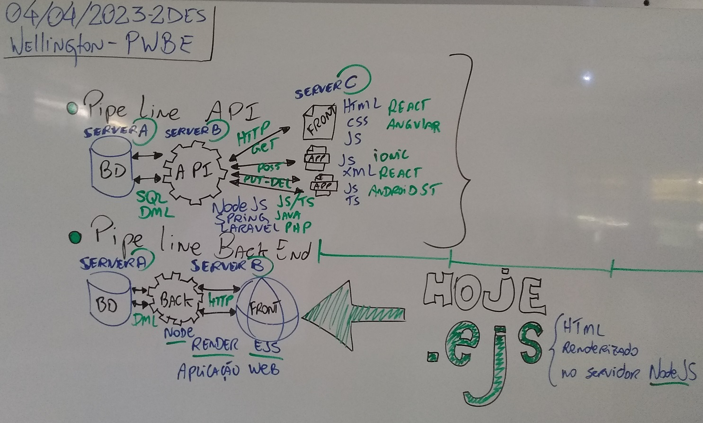

# Aula12 - BackEnd Integrado .EJS

## Aplicação de exemplo (Todo) Tarefas a fazer
- Necessário ter instalado localmente (NodeJS e MYSQL)
### Executar
- ./afazer
- Clonar este repositório
- Instalar o Banco de Dados:
	- Rodar o script ./docs/script.sql
- Abrir com VSCODE
- Abrir Terminal
```cmd
	npm i
	nodemon
```
- Abrir o navegador: http://localhost:3000