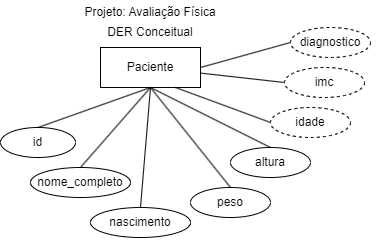
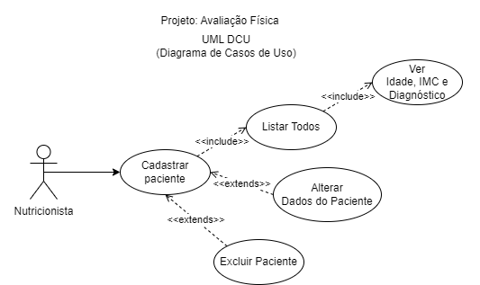

# Atividades Formativas

## 1 - Avaliação Física

|Contextualização:|
|-|
|A Sra. Carla Prestes é nutricionista e precisa de um sistema para cadastrar seus pacientes e que faça um rápido pré-diagnóstico|

- O Analista de sistemas já realizou a **análise de requisitos** e documentou conforme diagramas a seguir:

|Documento|Diagrama|
|-|-|
|DER Modelo Conceitual||
|UML - DC||
|UML - DCU||

|Desafio:|
|-|
|Você foi contratado como Programador Back-End, por isso deve desenvolver a API com as funcionalidades documentadas, utilize os dados a seguir para testar sua aplicação através da ferramenta **Insomnia**|

|Nome|Nascimento|peso|Altura|
|-|-|-|-|
|Jair Rodrigues|1981-01-03|85.5|1.75|
|Marieta Severo|1995-03-04|44.3|1.55|
|Karina Silva|2002-05-13|88|1,73|
|Solange Nascimento|2005-12-01|95|1.58|
|Marcos Pontes|2001-12-03|60|1.98|

|Observações:|
|-|
|Dados calculados nem sempre precisam ser armazenados em bancos de dados: 
- Podem ser calculados através de **visões**(Views) no SGBD e apenas exibidos os resultados, 
- Podem ser calculados na API back-end através de métodos/funções: 
    - Podem ser calculados quando os dados são listados um a um 
    - Podem ser calculados quando os dados são todos de uma vez 
    - Podem ser calculados quando os dados são cadastrados e armazenados no banco de dados 
- Para cada problema devemos avaliar qual a melhor alternativa quanto a processamento e armazenamento|