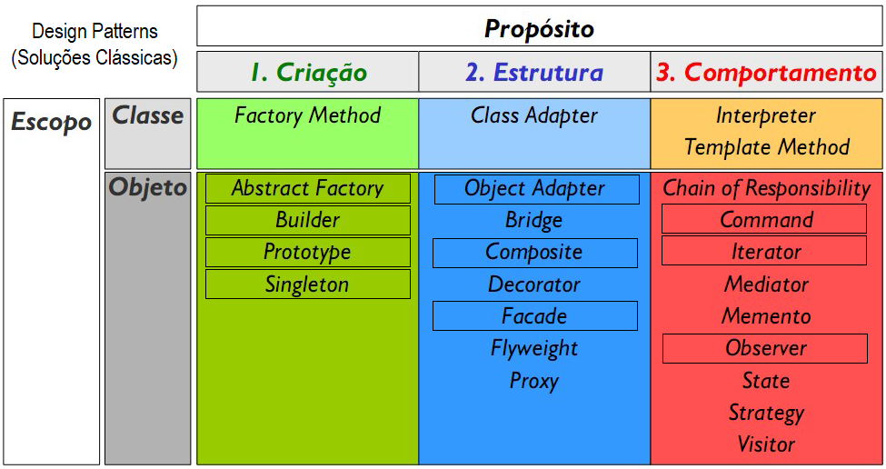

# 2. Padrão de desenvolvimento MVC
- 2.1. Definição
- 2.2. Aplicabilidade
- 2.3. Design patterns
# Design Patterns - GOF
- Criação
- Estrutura
- Comportamento
 

## Links importantes
- (patterns x standard) https://www.youtube.com/watch?v=GUanHEGlje4&t=1440s
- Slides: https://github.com/wellifabio/senai2021/blob/master/3des/projetos/aula22/design_patterns.pdf
- Exemplos com Java: https://github.com/wellifabio/senai2022/tree/master/3des/projetos/aula09/exemplo-java
- POO Classes em JavaScript https://developer.mozilla.org/pt-BR/docs/Web/JavaScript/Reference/Classes

## Atividades
### Atividade 1
|Descrição|Diagrama de Classes|
|-|-|
|Modele com JavaScript as classes conforme o diagrama de Classes, utilize o Pattern Builder e os dados a seguir para testar||

Dados para testar:

#### Veículos

|placa|modelo|marca|ano|idade|diaria|
|-|-|-|-|:-:|-|
|JHK-2518|Uno|Fiat|2015|**calcular**|75.9|
|PBC-5A58|Gol|VW|2018|**calcular**|99.9|
|CCB-2F19|Celta|Chevrolet|2007|**calcular**|49.9|

#### Aluguéis
|id|veículo|dataRetirada|dataDevolucao|valorAluguel|
|-|-|-|-|:-:|
|1|JHK-2518|2023-04-01|2023-04-06|**calcular**|
|1|PBC-5A58|2023-04-01|2023-04-08|**calcular**|
|1|PBC-5A58|2023-04-02|2023-04-07|**calcular**|
|1|CCB-2F19|2023-04-07|2023-04-16|**calcular**|
|1|JHK-2518|2023-04-08|2023-04-16|**calcular**|
