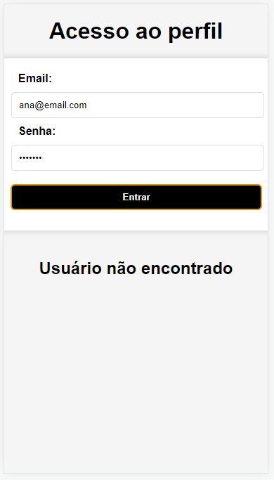
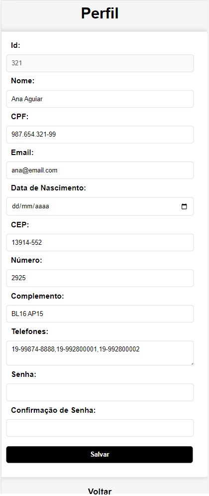

# Aula13 - Segurança
- Navegação entre páginas, tela de login
## Atividade
|Contextualização|
|-|
|A empresa que você traalha precisa de um aplicativo com controle de acesso em nível de usuário|

|Desafio|
|-|
|Com os dados apresentados no mockup a seguir, desenvolva uma tela de login e outra que exiba o perfil do usuário, não há necessidade de interação com API ou back-End neste momento, porém deixe as telas responsivas para monitores e celulares atuais|

- mokup.json
```json
{
    "id": 123,
    "nome": "Passos Dias Aguiar",
    "cpf": "123.456.789-01",
    "email": "passos@email.com",
    "senha": "-2884944701",
    "nascto": "2000-03-01",
    "endereco": {
        "cep": "13914-552",
        "numero": "2925",
        "complemento": "BL16 AP14"
    },
    "telefones": [
        "19-99874-8789",
        "19-992804020"
    ]
}
```
|login.html|perfil.html|
|-|-|
|||

|Obs:|
|:-|
|Para maior segurança, a senha deve ser criptografada com algoritmo md5|

|Entregas|
|-|
|Teste o aplicativo de um colega de turma e tente acessar o perfil ou descobrir a senha|