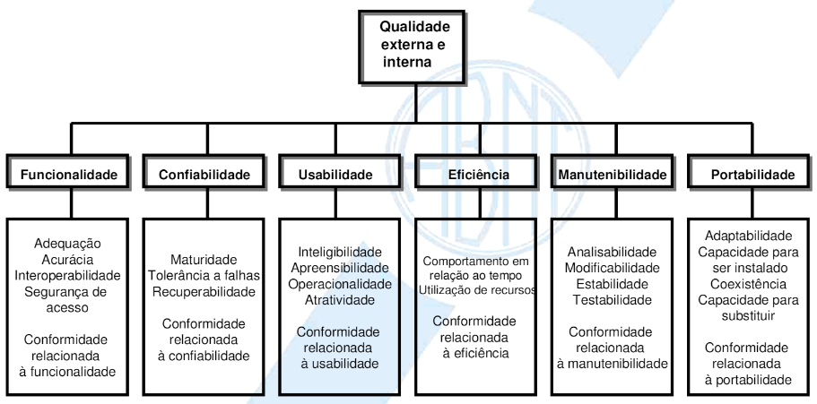
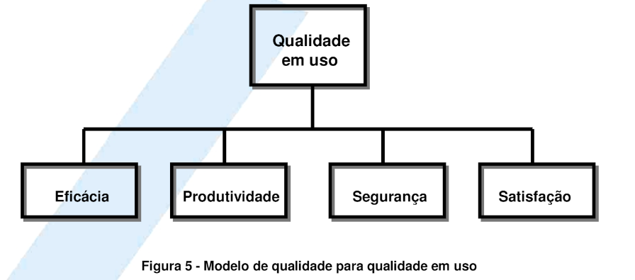
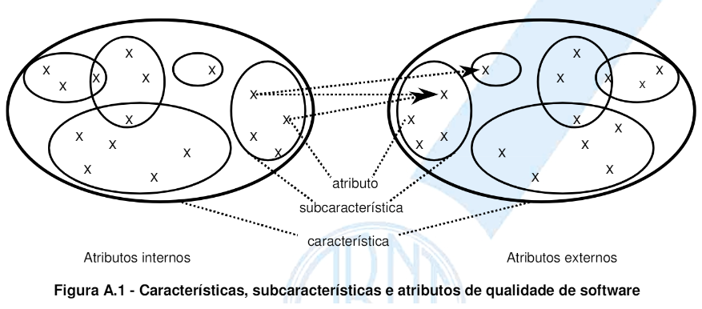

# Planejemento do Projeto
## Conhecimentos
- 1. Qualidade de software
	- 1.1. Definição
	- 1.2. Ferramentas
	- 1.3. Processos de trabalho
- Qualidade = Padrão => Norma
- NBR, ABNT, ISO

- Modelos

- Métrica
	- Atributos internos e externos
	- Métricas internas e externas
