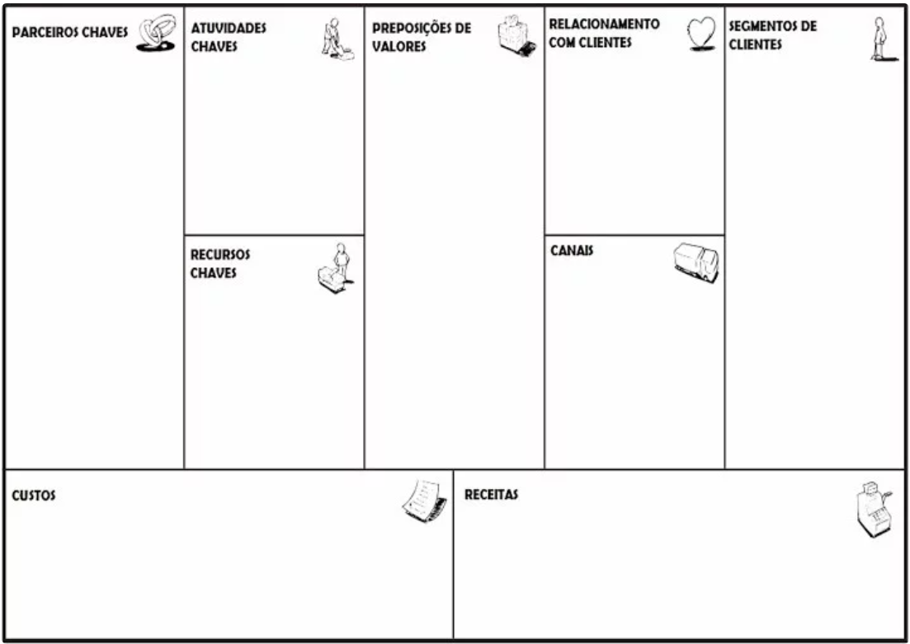

# Business Model Canvas:

## Como construir seu modelo de negócio?

- Link: https://digital.sebraers.com.br/blog/business-model-canvas-como-construir-seu-modelo-de-negocio/
- Autora: Carolina Niederauer (Consultado em 02/03/2023)

## Atividade
- Reuna seu grupo (dupla) discuta suas idéias e monte um modelo de negócio dev
- Crie seu quadro canvas
- Transforme em PDF ou PNG e anexe no formulário:
- Pode fazer mais de um modelo: