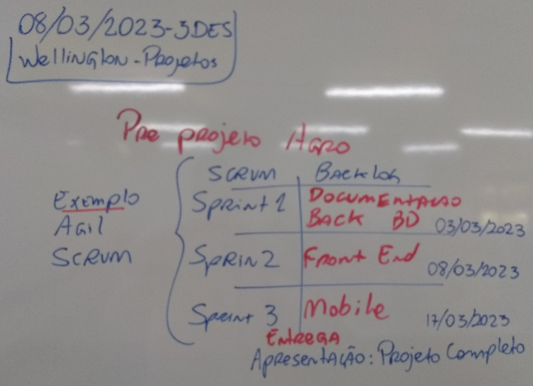

# Pré-projeto
## Tema: Agronegócio (Sistema de Gestão de Veículos)

## SCRUM
### Backlog:
|Etapas|Documentação|DEV|
|-|-|-|
|Planejamento e Execução|- Documentação: - Cronograma: - EAP (Estrutura analítica co projeto) &emsp;- Elencar as regras de negócio RN &emsp;- Análise de Requisitos &emsp;&emsp;- Funcionais RF (UML DCU) &emsp;&emsp;- Não Funcionais NF|Back-End &emsp;Testes Unitários (Insomnia) &emsp;Testes de Integração (Insomnia)|
|Execução e Controle|- MER DER (Conceitual) - UML DC (Diagrama de Classes)|Front-End &emsp;Testes Unitários &emsp;Testes de Integração &emsp;Testes Ponto a Ponto|
|Execução e Controle|- Plano de testes - Concluir documento do Projeto|Mobile &emsp;Testes Unitários &emsp;Testes de Integração &emsp;Testes Ponto a Ponto|

## Sprint 1
### Backlog:
|Planejamento e Execução|- Documentação: - Cronograma: - EAP (Estrutura analítica co projeto) &emsp;- Elencar as regras de negócio RN &emsp;- Análise de Requisitos &emsp;&emsp;- Funcionais RF (UML DCU) &emsp;&emsp;- Não Funcionais NF|Back-End &emsp;Testes Unitários (Insomnia) &emsp;Testes de Integração (Insomnia)|
|-|-|-|
## Sprint 2
### Backlog:
|Execução e Controle|- MER DER (Conceitual) - UML DC (Diagrama de Classes)|Front-End &emsp;Testes Unitários &emsp;Testes de Integração &emsp;Testes Ponto a Ponto|
|-|-|-|

## Sprint 3
### Backlog:
|Execução e Controle|- Plano de testes - Concluir documento do Projeto|Mobile &emsp;Testes Unitários &emsp;Testes de Integração &emsp;Testes Ponto a Ponto|
|-|-|-|

## Entregas
### Estrutura do documento do projeto
- Capa
- Contra Capa
- Resumo
- Sumario
- Justificativa
- Objetivos
    - Geral
    - Específico
- Introdução
- Capítulo I TAP
- Capítulo II Cronograma
- Capítulo III EAP
    - Definições e orientações
    - RN (Regras de negócio)
    - RF (Requisitos Funcionais + Diagramas)
    - NF (Requisitos não Funcionais, Organograma)
- Capítulo IV Orçamento
- Capítulo V Documentação
    - MER DER
    - Diagrama de Classes
- Capítulo VI Execução
    - Front End (Print das Telas)
    - Back End (Print das Telas)
- Capítulo VII Controle
    - Plano de Testes (CheckList)
    - Relatório de testes
- Conclusão
    - Cronograma da execução
    - Resultados (Resumo das lições aprendidas)
- Bibliografias
 OBS: Deverá ser entregue em PDF

### Repositório github
- back
- front
- app
- docs