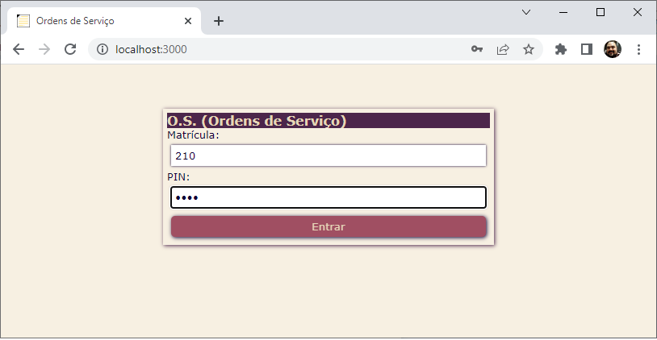
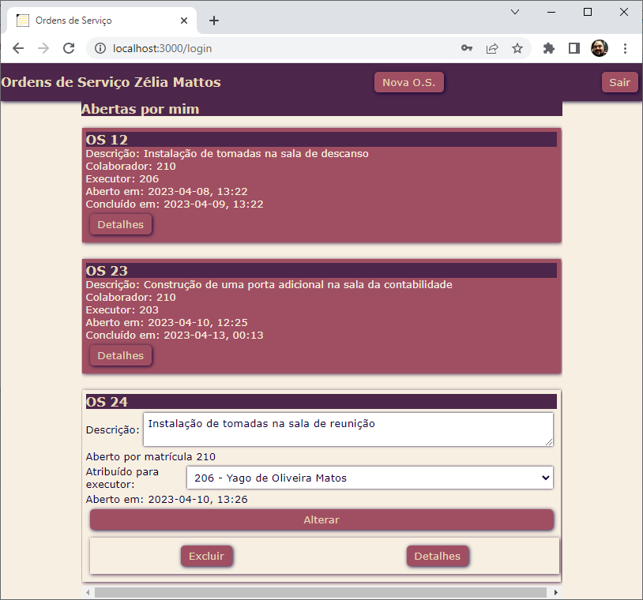
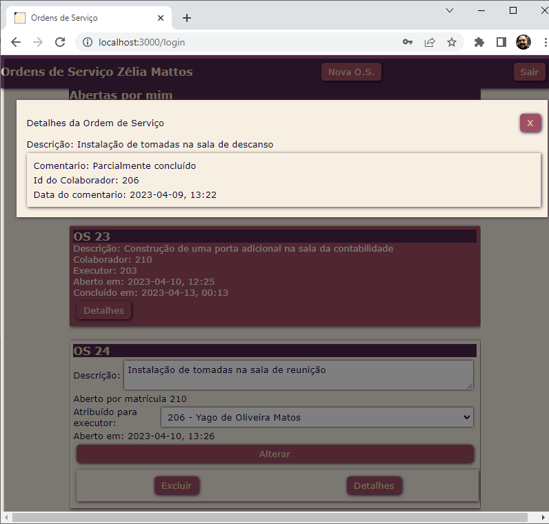
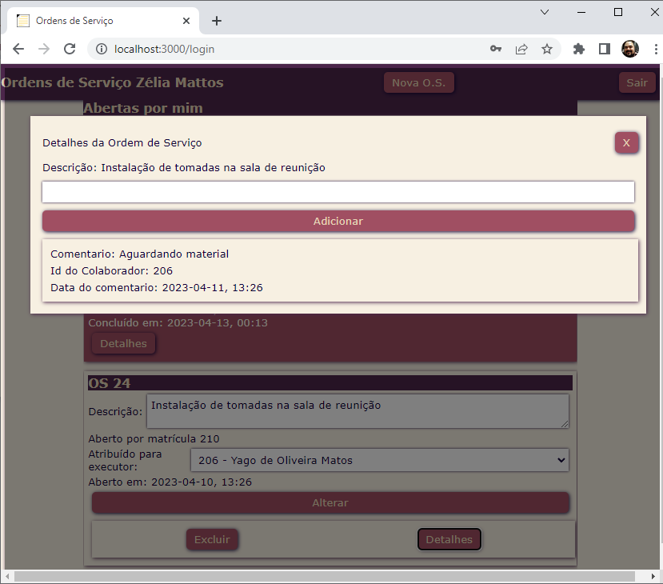
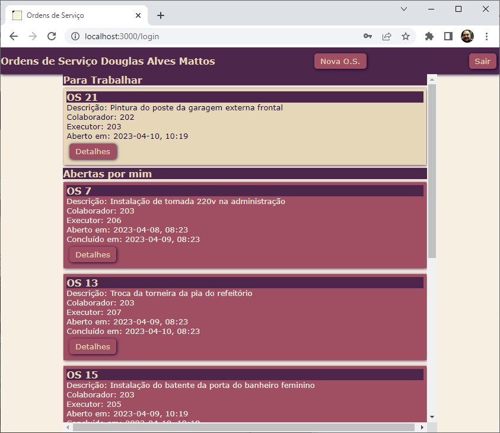
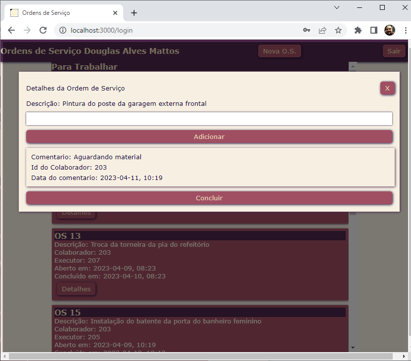
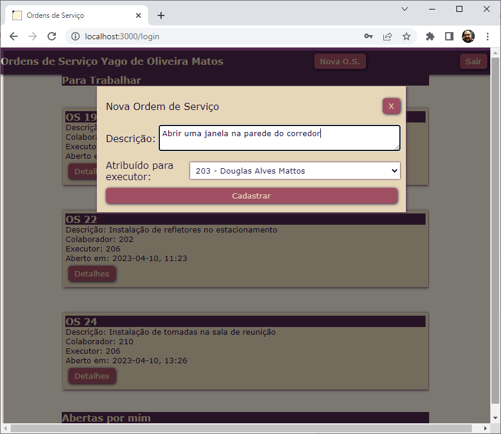
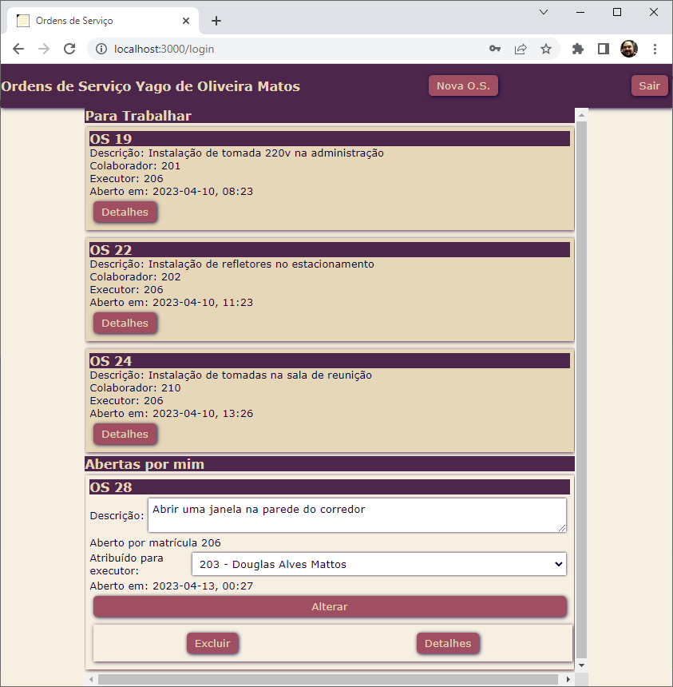

# Exemplo BackEnd (NodeJS + Prisma(ORM) MySQL + Pug)
* Necessário ter NodeJS e MySQL instalados
1. Clonar este reposiório:
    - git clone
2. Instalar as dependência
    - npm install
3. Criar um arquivo chamado **.env** contendo
```env
DATABASE_URL="mysql://root@localhost:3306/os?schema=public&timezone=UTC"
```
4. Instalar prisma globalmente e executar a migração
```cmd
npm i -g prisma
prisma migrate dev --name "primeira_migracao"
```
5. Instalar pelo menos os dados de teste a seguir no banco de dados, via phpmyadmin, mysqlworkbank ou cmd
```sql
use os;
insert into colaborador values
(300,'Maria','Gerente','Administração',1234),
(301,'Marta','Aux. Manutenção','Manutenção',1234),
(302,'Paula','Recepcionista','Recepção',1234);
```
6. Iniciar a aplicação
    - npm start
    - ou node app.js
    - ou nodemon
7. Executar no caminho: http://localhost:3000<br>
<br>
<br>
<br>
<br>
<br>
<br>
<br>
<br>