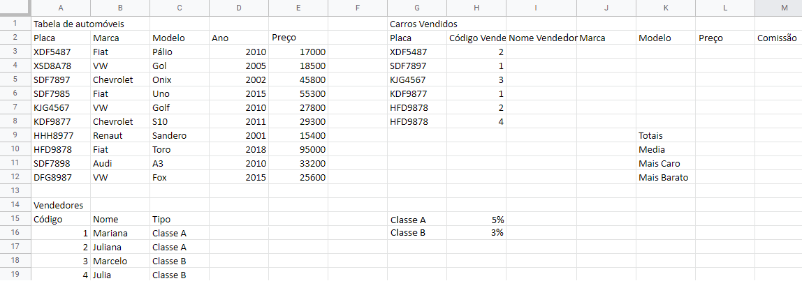

# Excel Aula 09
## Avaliação Formativa de Excel

1. Abra o Excel e copie esta planilha
2. Salve em Documentos com o nome de "Agência de automóveis"
3. Preencha a coluna **I** (Nome Vendedor) com os nomes respectivos aos códigos dos vendedores
   - Para isso utilize a função PROCV(**Cod. Vendedor;Vendedores;2**)
4. Preencha a coluna **J** (Marca) com a marca de cada carro vendido
   - Utilize a função PROCV(**Placa;Tabela de automoveis;2**)
5. Preencha a coluna **K** (Modelo) com o modelo de cada carro vendido
   - Utilize a função PROCV(**Placa;Tabela de automoveis;3**)
6. Preencha a coluna **L** (Preço) com o preço de cada carro vendido
   - Utilize a função PROCV(**Placa;Tabela de automoveis;5**)
7. Preencha a coluna **M** (Comissão) multiplicando o **Preço** pela **porcentagem** de comissão:
   - Sabendo que se o vendedor for **Classe A** a comissão é 5%
   - Se o vendedor for **Classe B** a comissão é 3%
   - A fórmula é o **Preço** * **Porcentagem**
8. Calcule as **estatísticas**:
   * Totais
   * Média
   * Mais caro
   * Mais Barato
9. Formate a planilha **Mesclando e centralizando** os títulos
   * Colocando, bordas, cores se necessário
   * Formate os preços colocando-os em reais (R$)
   * Destaque as estatísticas

10. Faça um gráfico selecionando as colunas **Modelo** e **Preço** dos automóveis, escolha um dos gráficos recomendados pelo Excel.

### Ao concluir chame o professor para corrigir

