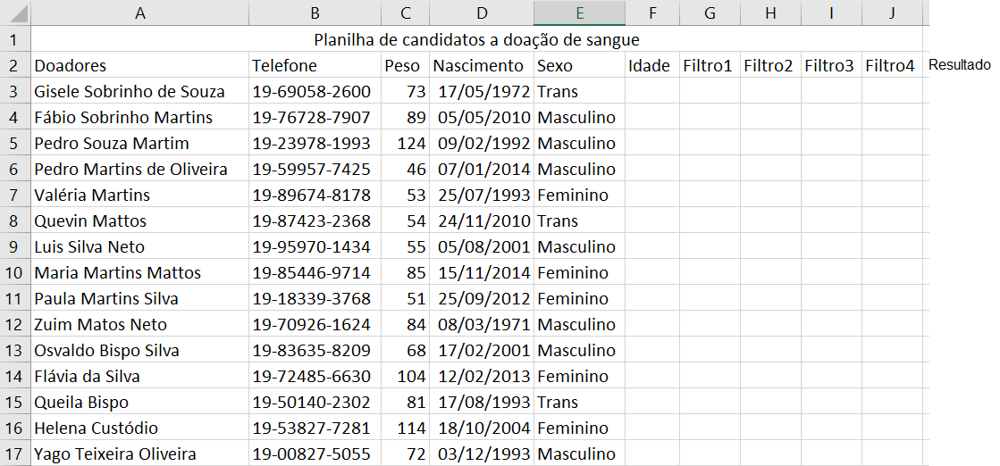

# Excel - Aula02 (Cálculos com data e hora)
- CTRL + ; => Data Atual
- CTRL + Shift + ; => Hora Atual
# Atividade 1

# Atividade 2

## Instruções
- Filtro 1: Somente adulos podem doar sangue, por isso o primeiro filtro é a idade
    - Se a idade form maior ou igual a 18 anos "Adulto" senão "Criança"
- Filtro 2: Mulheres só doam sangue se pesarem 55kilos ou mais, homens e trans 50Kilos ou mais
- Filtro 3: 