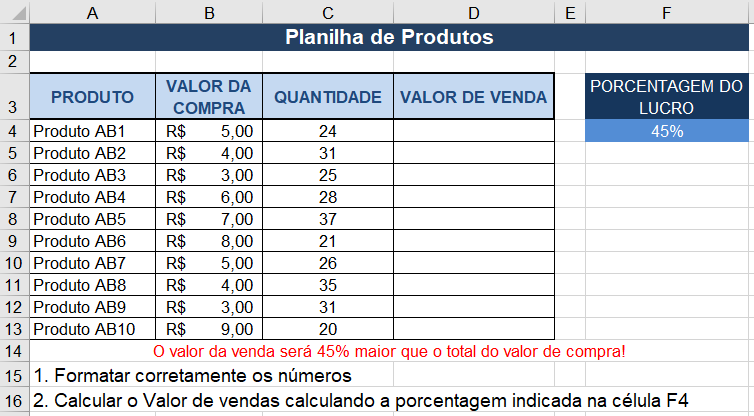

# Excel - Aula03
- Atividades com fórmulas e funções
## Exercícios:
### Exercício 1 - Cálculo com porcentágem:

### Exercício 1 - Função Média:

### Exercício 1 - Função Máximo:

### Exercício 1 - Função Mínimo:

### Exercício 1 - Função Maior:

### Exercício 1 - Função Menor:

### Exercício 1 - Função Hoje, cálculos com datas:

