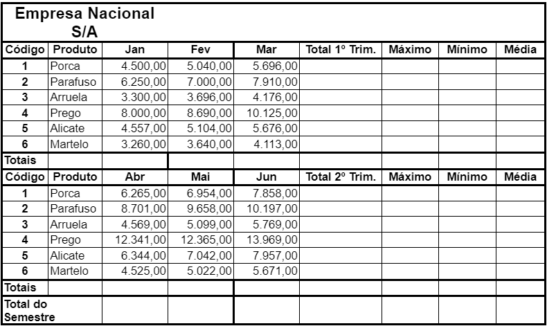
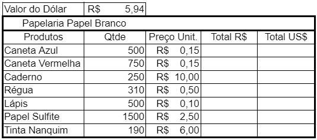
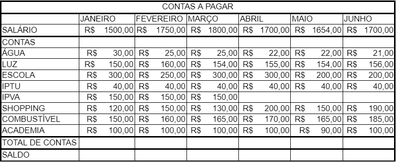
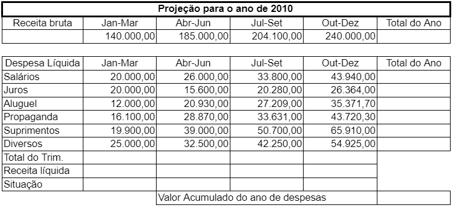

# Excel - Aula04
- Atividades com cálculos básicos, formulas e funções
## Atividade 1: Estatísticas Soma(), Maximo(), Mínimo() e Media()

- 1ª Tabela:
    - Total 1º Trimestre: soma das vendas dos meses de Jan / Fev / Mar.
    - Máximo: calcular o maior valor entre os meses de Jan / Fev / Mar.
    - Mínimo: calcular o menor valor entre os meses de Jan / Fev / Mar.
    - Média: calcular a média dos valores entre os meses de Jan / Fev / Mar.
- 2ª Tabela:
    - Total 2º Trimestre: soma das vendas dos meses de Abr / Mai / Jun.
    - Máximo: calcular o maior valor entre os meses de Abr / Mai / Jun.
    - Mínimo: calcular o menor valor entre os meses de Abr / Mai / Jun.
    - Média: calcular a média dos valores entre os meses de Abr / Mai / Jun.
- Totais: soma das colunas de cada mês (1ª e 2ª tabela).
- Total do Semestre: soma dos totais de cada trimestre.

## Atividade 2: Cálculo simples e congelar céluças

- Calcular o Total R\$: multiplicar Qtde por Preço Unitário
- Calcular Total US\$: dividir *Total R\$* por Valor do Dólar – usar '$' nas fórmulas
- Alterar as colunas de acordo com a necessidade.

## Atividade 3: Cálculo porcentagem simples

- **INSS R$**: multiplicar Salário Bruto por INSS.					
- **Gratificação R\$**: multiplicar Salário Bruto por Gratificação.
- **Salário Líquido**: Salário Bruto mais Gratificação R$ menos INSS R\$.
- Formatar os números para que eles apareçam de acordo com a planilha dada.

## Atividade 4: Finanças pessoais

- **Total de Contas**: soma das contas de cada mês.
- **Saldo**: Salário menos Total de Contas.
- Acrescente uma linha **Aluguel** nas contas com R\$ 650,00 para cada mês
- Acrescente mais uma fonte de renda chamada **Bico** some ao salário e recalcule o Saldo

## Atividade 5: Finanças Empresariais Receitas x Despesas

- **Total do Ano** Receita Bruta: Soma das receitas anuais.				
- **Total do Ano** Despesa Líquida: Soma das despesas anuais.				
- **Total do Trimestre**:  Soma das despesas trimestrais.				
- **Receita Líquida**:  Receita Bruta menos Total do Trimestre.
- **Valor Acumulado do ano de despesas**: Soma do Total do Ano de Despesas
- **Situação:**
	- Se Receita Líquida for menor que R$ 1.000,00, "Prejuízo"; 			
	- Senão se Receita Líquida for maior ou igual a R$ 1.000,00, "Lucro";			
- Altere os critérios da situação acrescentando uma situação intermediária
- **Situação:**
	- Se Receita Líquida for menor que R$ 1.000,00, "Prejuízo Total"; 			
	- Se Receita Líquida for menor que R$ 5.000,00, "Lucro Médio";			
    - Se Receita Líquida for maior que R$ 5.000,00, "Lucro Total'.	