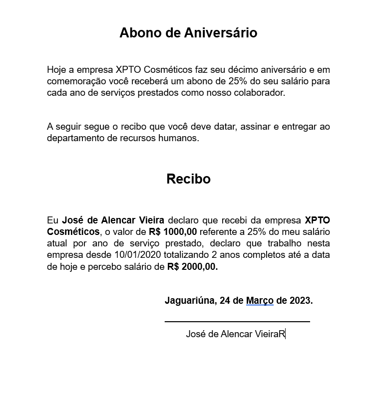
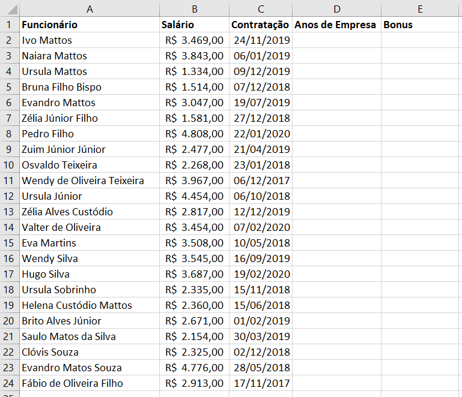

# (Word e Excel) Mala direta

- Mala direta, tecnicamente é um documento ligado a um banco de dados.
- Ex:
    - um convite,
    - um comunicado,
    - um recibo,
    - uma carta de cobrança.
## Missão:
- 1. Crie uma pasta no seu computador/documentos com o nome de **"Abono"**
- 2. Escreva a carta a seguir utilizando o **Word** e salve dentro da pasta Abono com o nome de **"Recibo"**.

- 3. Digite a planilha a seguir:
    
    - A. calcule os **Anos de Empresa** de cada funcionário.
    - B. Calcule o **Bônus** conforme informa o **Recibo**
    - C. Salve na pasta **"Abono"** com o nome de **"funcionarios"**
- 4. Informe ao professor que terminou e aguarde instruções para concluir
    - Pois precisamos de um recibo deste para cada funcionário.